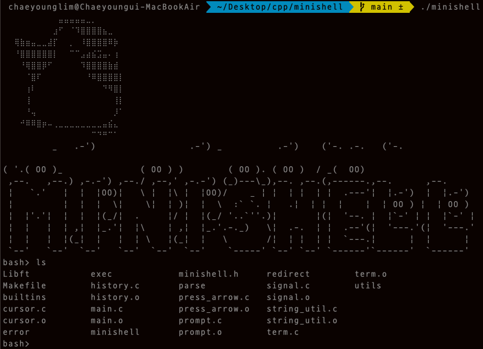
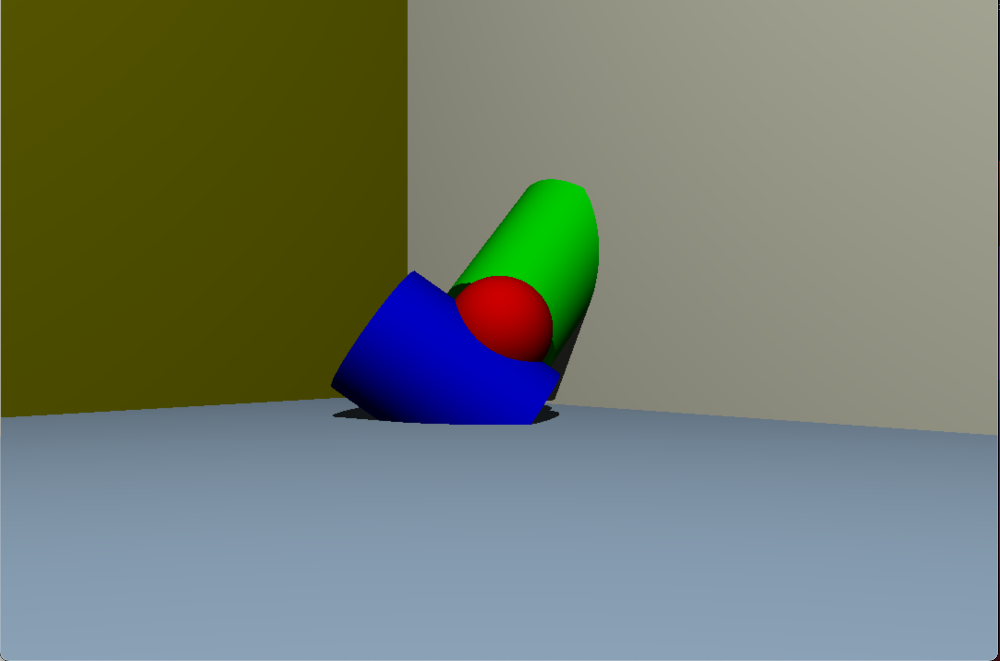

# cpp_projects
Projects with C and C++

### 1. Minishell

#### 1.1. Implementation

UNIX 명령어 인터프리터인 shell의 구현을 목표

- 명령 프롬프트를 띄워고, 사용자의 명령어 입력이 enter 키를 통해 수행될 때 까지 대기
- 프롬프트는 명령이 완전히 실행된 후에만 다시 표시된다.
- PATH 변수 및 상대/절대 경로에 기반한 실행 파일을 올바르게 찾아 실행하며 이가 불가능한 경우 오류 메시지를 표시하고 프롬프트를 다시 표시

- 쉘 내장 함수의 구현

  - `echo` (with option `-n`)
  - `cd` (with only relative or absolute path)
  - `pwd`
  - `export`
  - `unset`
  - `env` (without any options and any arguments)
  - `exit`

- 그 외에 shell의 기초적인 부분의 구현

  - parsing 과정에서의 `'` , `"`의 구분
  - file descriptor aggregation를 제외한 리다이렉션(`<`, `>`, `>>`)
  - 파이프(`|`)
  - 환경변수(`$` followed by characters)
  - `$?`
  - `ctrl-C`, `ctrl-D`, `ctrl-\`

#### 1.2. Result

### 2. STL

#### 2.1. Implementation

자료 구조와 템플릿 프로그래밍의 이해를 바탕으로 c++98 기준의 STL의 일부를 구현을 목표
- vector, map, stack, set에 대한 기본적인 멤버 함수, 비멤버 함수, 오버로드를 구현
- 할당자는 std::allocator 를 사용
- map과 set의 바탕을 이루는 자료구조로써 RB Tree를 구현
- 이 외에는 다음과 같은 항목들을 재구성
	- iterator_traits
	- reverse_iterator
	- enable_if
	- is_integral
	- equal
	- lexicographical_compare
	- pair
	- make_pair

### 3. miniRT

#### 3.1. Implementation

기본적인 레이 트레이싱의 원리와 동작 이해를 통한 렌더링 엔진 구현을 목표
- 레이 트레이싱을 사용하여 렌더링 이미지를 생성
- 렌더링 이미지를 스크린으로 출력하거나 BMP 파일로 저장
- *.rt 포맷의 씬 파일을 읽어 해당 씬에 대한 정보를 바탕으로 이미지를 렌더링
- 카메라의 갯수, 각도, 위치를 설정하여 이미지를 렌더링
- 평면, 구, 원통 3개의 도형을 표현
- Point Light 조명으로 다양한 색과 조명을 표현
- 조명으로 생기는 Hard Shadow를 표현
- wasd 키를 통하여 카메라 이동 및 전환

#### 3.2. Result

